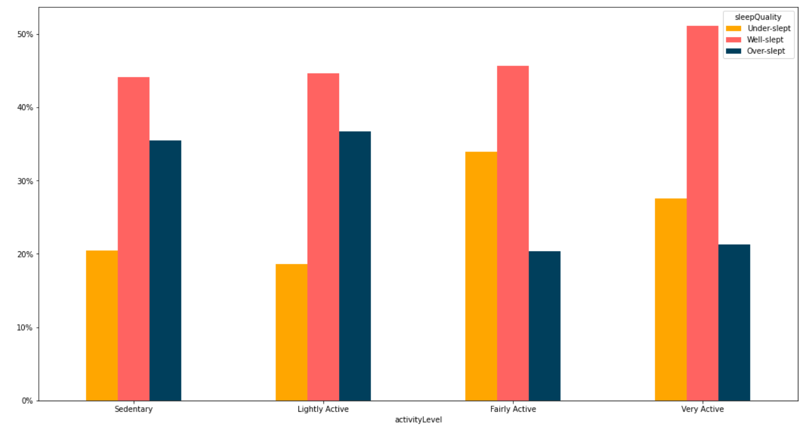

# GDAC Bellabeat Case Study: Python
Google Data Analytics Certificate Bellabeat Capstone Project Using Python

## Project Status
Complete

## Project Screen Shot(s)

## Installation and Setup Instructions

#### Example:  

You will need `Python` and `Jupyter Notebooks` installed globally on your machine.  

Clone down this repository. 

Open `bellabeat.ipynb` as a Jupyter Notebook.

Alternatively, you can [copy and edit the notebook on Kaggle](https://www.kaggle.com/code/euanwindsor/gdac-case-study-python-bellabeat).
